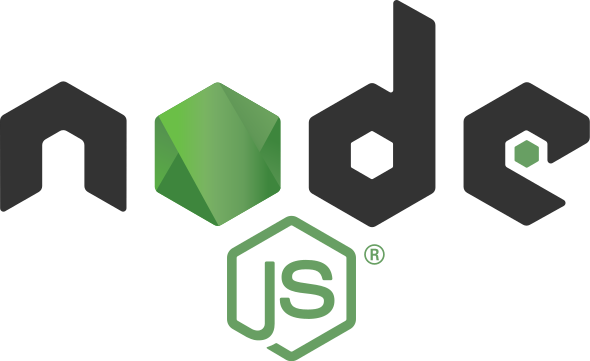

### Hi I'am Ali Özkan 👾
---
I am Ali Özkan. I have been developing Web Applications mainly with NodeJS and Typescript since 2015. I have had several experiences as Full Stack, Backend and Frontend Developer in multiple companies and independent projects.

#### Technologies 🔥
| |  |  |  |
|:---:|:---:|:---:|:---:|

#### Learning 📕
|  |  |
|:---:|:---:|

#### Youtube  🎬
|  |  |
|:---:|:---:|

 

	

